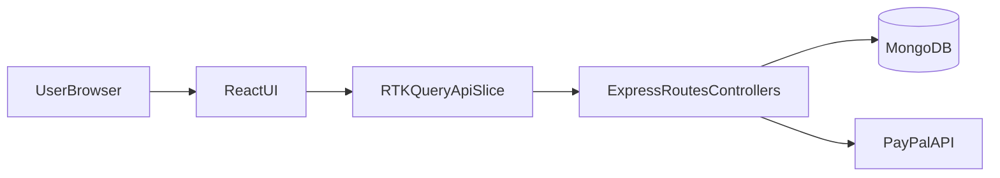

# Kế hoạch đọc project ProShop v2

## Mục tiêu
- Nắm kiến trúc tổng thể MERN + Redux Toolkit của project trong 1 lần đọc có định hướng.
- Hiểu luồng chính: request API -> xử lý backend -> lưu DB -> gọi từ frontend -> render UI.
- Xác định sớm các khu vực có ghi chú lịch sử/sửa lỗi để tránh hiểu nhầm khi maintain.

## Vòng 1: Nắm tổng quan (10-20 phút)
- Đọc [README](/home/killer/development/projects/proshop-v2/readme.md) để hiểu feature, cách chạy, biến môi trường và bối cảnh lịch sử bugfix.
- Đọc [package.json](/home/killer/development/projects/proshop-v2/package.json) để nắm scripts gốc (`dev`, `server`, `client`, `data:import`, `data:destroy`).
- Đọc [.env.example](/home/killer/development/projects/proshop-v2/.env.example) để map các phụ thuộc runtime (Mongo, JWT, PayPal).

## Vòng 2: Đọc backend theo luồng request (25-40 phút)
- Bắt đầu từ [server.js](/home/killer/development/projects/proshop-v2/backend/server.js): middleware, mount routes, static serving, error handling.
- Đọc route đại diện [orderRoutes.js](/home/killer/development/projects/proshop-v2/backend/routes/orderRoutes.js) để thấy phân quyền/auth.
- Theo route vào controller [orderController.js](/home/killer/development/projects/proshop-v2/backend/controllers/orderController.js) để hiểu nghiệp vụ đặt hàng, thanh toán, trạng thái.
- Đọc model liên quan [orderModel.js](/home/killer/development/projects/proshop-v2/backend/models/orderModel.js) để map dữ liệu với nghiệp vụ.
- Đọc [db.js](/home/killer/development/projects/proshop-v2/backend/config/db.js) để chốt cơ chế kết nối MongoDB.

## Vòng 3: Đọc frontend theo luồng màn hình -> API -> state (25-40 phút)
- Vào [index.js](/home/killer/development/projects/proshop-v2/frontend/src/index.js) để nắm routing tree và provider setup.
- Đọc [store.js](/home/killer/development/projects/proshop-v2/frontend/src/store.js) để hiểu state architecture (slices + RTK Query).
- Đọc [apiSlice.js](/home/killer/development/projects/proshop-v2/frontend/src/slices/apiSlice.js) để nắm baseQuery, auth expiry handling và chuẩn gọi API.
- Đọc [ordersApiSlice.js](/home/killer/development/projects/proshop-v2/frontend/src/slices/ordersApiSlice.js) như ví dụ endpoint thực tế nối frontend-backend.
- Đọc [constants.js](/home/killer/development/projects/proshop-v2/frontend/src/constants.js) để chốt endpoint constants/base URL.

## Sơ đồ kiến trúc để bám khi đọc

## Điểm cần lưu ý khi đọc
- README có phần lịch sử fix/FAQ khá dài: xem như bối cảnh, ưu tiên hành vi hiện tại trong code đang chạy.
- Repo có cả `package-lock.json` và `pnpm-lock.yaml`: chú ý thống nhất package manager khi bắt đầu làm việc để tránh lệch dependency.
- Khi đọc cache invalidation ở frontend, để ý sự nhất quán tag trong các API slices.

## Kết quả mong đợi sau khi đọc
- Bạn mô tả được 1 luồng hoàn chỉnh: tạo order từ UI đến DB và phản hồi lại màn hình.
- Bạn xác định được file “điểm vào” để debug nhanh cho backend và frontend.
- Bạn có danh sách file ưu tiên để bắt đầu thay đổi tính năng/bugfix mà không cần scan toàn bộ repo.