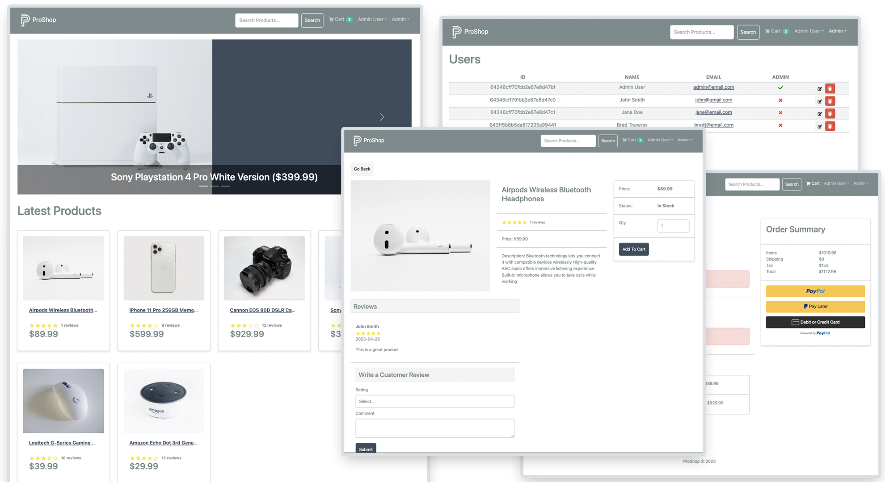

# ProShop eCommerce Platform (v2)

> A full-featured eCommerce platform built with the MERN stack (MongoDB, Express, React, Node.js) & Redux Toolkit.



This is a complete eCommerce application featuring a shopping cart, product reviews, admin panel, and integrated PayPal & credit/debit card payments.

<!-- toc -->

- [Features](#features)
- [Tech Stack](#tech-stack)
- [Usage](#usage)
  - [Env Variables](#env-variables)
  - [Install Dependencies](#install-dependencies)
  - [Run](#run)
- [Build & Deploy](#build--deploy)
  - [Seed Database](#seed-database)
- [License](#license)

<!-- tocstop -->

## Features

- Full featured shopping cart
- Product reviews and ratings
- Top products carousel
- Product pagination
- Product search feature
- User profile with orders
- Admin product management
- Admin user management
- Admin Order details page
- Mark orders as delivered option
- Checkout process (shipping, payment method, etc)
- PayPal / credit card integration
- Database seeder (products & users)

## Tech Stack

**Frontend:**
- React 18
- Redux Toolkit
- React Router v6
- Bootstrap 5

**Backend:**
- Node.js / Express
- MongoDB with Mongoose
- JWT Authentication
- Multer (file uploads)

## Usage

- Create a MongoDB database and obtain your `MongoDB URI` - [MongoDB Atlas](https://www.mongodb.com/cloud/atlas/register)
- Create a PayPal account and obtain your `Client ID` - [PayPal Developer](https://developer.paypal.com/)

### Env Variables

Rename the `.env.example` file to `.env` and add the following

```
NODE_ENV = development
PORT = 5000
MONGO_URI = your mongodb uri
JWT_SECRET = 'abc123'
PAYPAL_CLIENT_ID = your paypal client id
PAGINATION_LIMIT = 8
```

Change the JWT_SECRET and PAGINATION_LIMIT to what you want

### Install Dependencies

```bash
pnpm install
cd frontend
pnpm install
```

### Run

```bash
# Run frontend (:3000) & backend (:5000)
pnpm run dev

# Run backend only
pnpm run server

# Run frontend only
cd frontend
pnpm run dev
```

## Build & Deploy

```bash
# Create frontend prod build
cd frontend
pnpm run build
```

### Seed Database

You can use the following commands to seed the database with sample users and products

```bash
# Import data
pnpm run data:import

# Destroy data
pnpm run data:destroy
```

Sample user logins:
```
admin@email.com (Admin) - 123456
john@email.com (Customer) - 123456
jane@email.com (Customer) - 123456
```

## License

MIT
